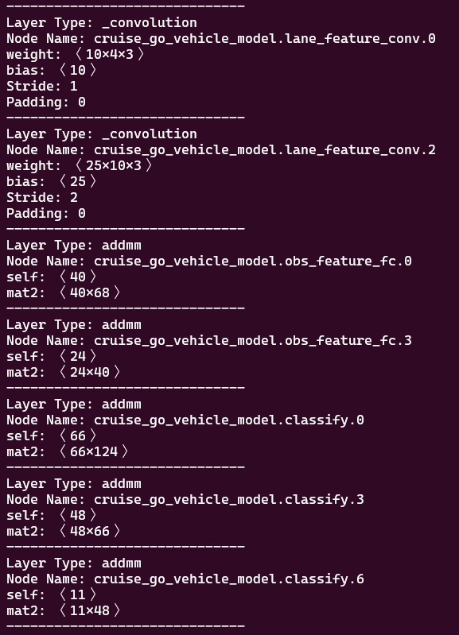

# netronapp-scraper
Web Scraper for the [Netron.app](https://netron.app/) website to help extract information from your neural network architecture. 

# Instructions

* Make sure the chromedrive version is equal to your chrome browser's version

* Install dependencies listed in the requirements.txt file

* Run the scraping script 

```bash p
python run.py
```

* Once the Netron.app website opens, please upload your model. 

* After uploading your model, please click enter in your terminal

* You should now see the attributes of each layer being printed out. 




## Helpful Commands

* Your Chrome Version must match the chromedriver

* Check Chrome Version

```bash
google-chrome-stable --version
```


* Get Chrome Driver (might be from another website)

```bash
wget https://edgedl.me.gvt1.com/edgedl/chrome/chrome-for-testing/115.0.5790.170/linux64/chromedriver-linux64.zip
```
